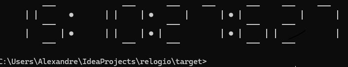

# Relogio CLI

## Descrição

O projeto implementa um Relogio Digital com precisão de millessegundos, que roda no terminal




## Execução
- Configure o cmd para UTF8 executando
```bash
chcp 65001
```
- Execute o arquivo compilado
```bash
java -jar out/relogio-1-0-SNAPSHOT.jar
```

## Recursos
 - java 21
 - maven